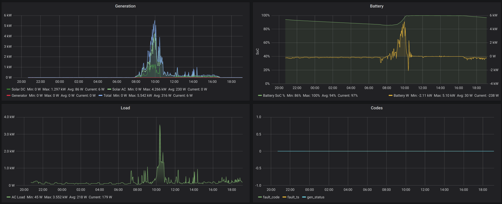

# Select.Live Influx

A utility to read performance data from a Select.Live device and send to InfluxDB.

The end goal is to render performance data in Grafana, but the storage in InfluxDB is not specific to Grafana so may be useful in other cases.

The easiest way to have Grafana render the data appears to store it in [InfluxDB](https://www.influxdata.com/) and the easiest way to capture data from a SP Pro is to query the [Select.Live](http://www.selectronic.com.au/monitoring/) device if one is already in place - so that's what this code does.

<!-- TOC -->

- [Select.Live Influx](#selectlive-influx)
- [Grafana Example](#grafana-example)
- [Installing in Raspbian using Docker](#installing-in-raspbian-using-docker)
- [Alternatives](#alternatives)

<!-- /TOC -->

# Grafana Example



# Installing in Raspbian using Docker

This isn't best practice - it's just what I'm doing for now to get it running on a Raspberry Pi.

Install pre-requisists:

```
root@rasp:~# apt install git docker.io
```

Create a user  that can run Docker:

```
root@rasp:~# useradd -m select-influx
root@rasp:~# usermod -aG docker select-influx
```

Clone the repo:

```
root@rasp:~# cd /opt
root@rasp:/opt# 
root@rasp:/opt# git clone https://github.com/neerolyte/select-live-influx.git
```

Create a `.env` file:

```
root@rasp:/opt# cp ./select-live-influx/.env{.dist,}
```

Edit `/opt/select-live-influx/.env` to suit your installation.

Create a service file at `/etc/systemd/system/select-live-influx.service` with contents:

```
[Unit]
Description=Select live influx
After=network.target

[Service]
ExecStart=/opt/select-live-influx/scripts/docker node index.js
#ExecStart=/usr/bin/node index.js
WorkingDirectory=/opt/select-live-influx
StandardOutput=inherit
StandardError=inherit
Restart=always
User=select-influx

[Install]
WantedBy=multi-user.target
```

Ask systemd to enable and start the service:

```
root@rasp:~# systemctl reenable select-live-influx
Created symlink /etc/systemd/system/multi-user.target.wants/select-live-influx.service → /etc/systemd/system/select-live-influx.service.
root@rasp:~# systemctl restart select-live-influx
```

# Alternatives

 * <https://github.com/angus-g/splink-influx> - Export SP Pro data via serial over ethernet to InfluxDB
 * <https://github.com/neerolyte/selpi> - Direct SP Pro serial connection (no export, yet)